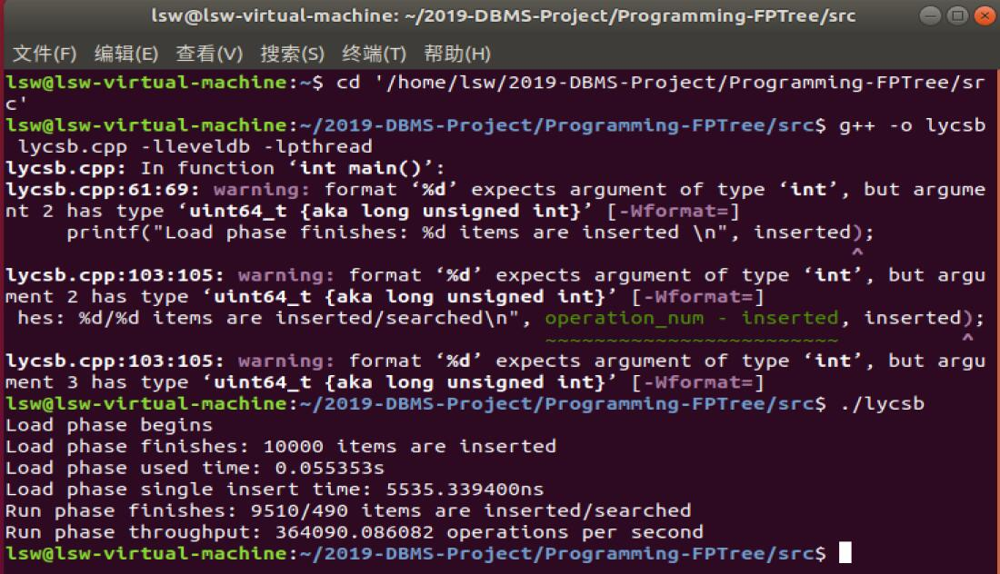
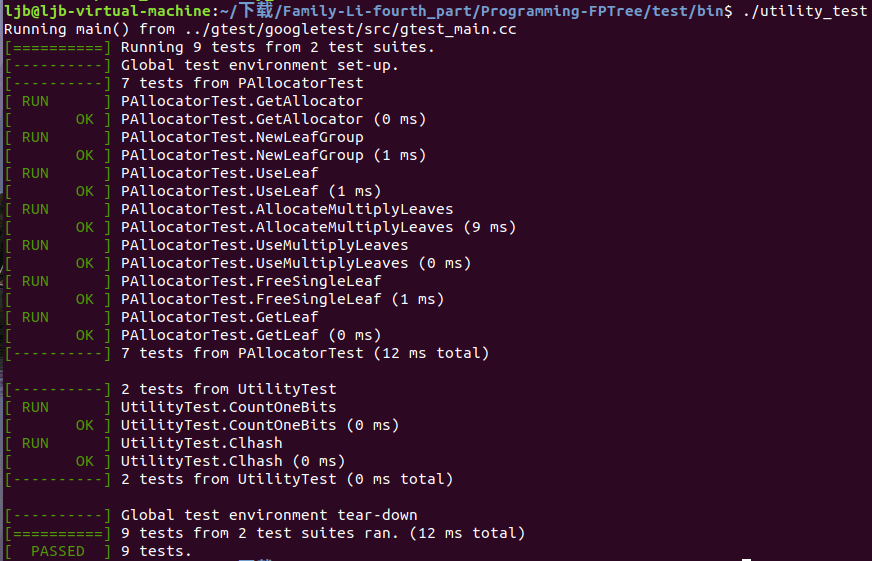
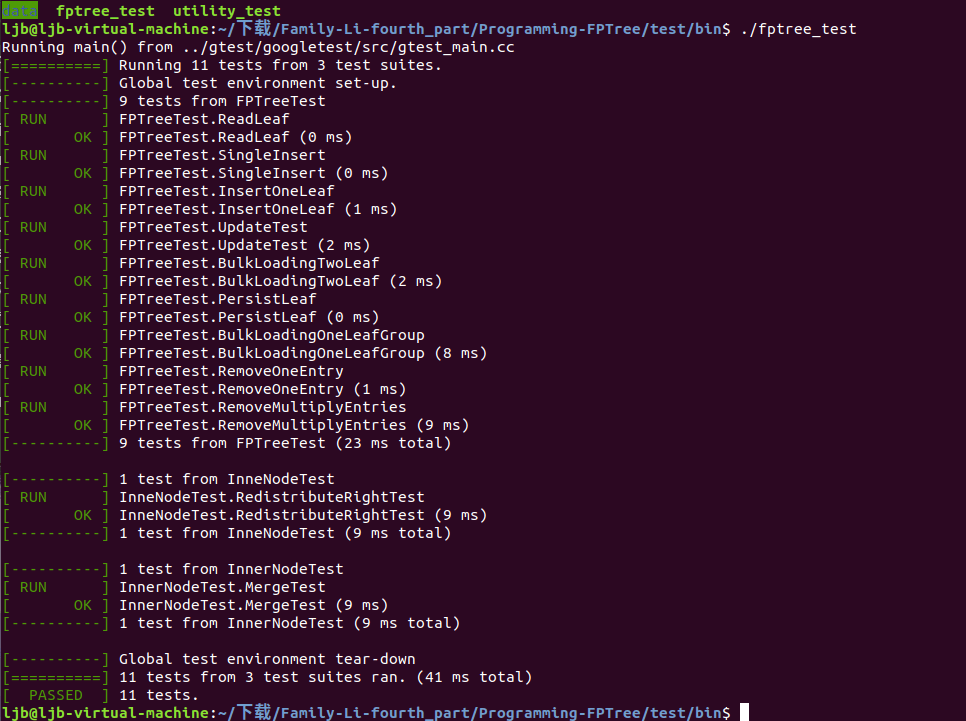

# **系统说明书**

小组成员：李僖哲、李文浩、李赛尉、李济邦、李宸

学号（对应）：17343064，17343063，17343062，17343061，17343060

## 系统基本说明

### **项目概述**

本项目是数据库课程设计项目，主要包括前期论文的阅读，和FPTreeDB键值存储系统的实现，形成了一个简单的键值存储引擎FPTreeDB，我们通过将其包装成一个调用库，供用户程序使用并管理其数据存储。项目以https://github.com/ZhangJiaQiao/2019-DBMS-Project/tree/master/Programming-FPTree给出的框架为基础，在组员的协作分工下完成了整个系统的实现。

### **文件目录结构说明**

本文件结构与https://github.com/ZhangJiaQiao/2019-DBMS-Project/tree/master/Programming-FPTree的文件结构相同（如下），相比之下只修改了部分cpp文件（修改内容见实现时间计划）。

|__gtest: 为Google Test项目目录，不用管  
|__include: 里包含所有用到的头文件  
   |__fptree: fptree的头文件所在文件夹  
      |__fptree.h: fptree地头文件  
   |__utility: fptree所用工具的头文件所在文件夹  
      |__utility.h: 指纹计算等工具函数所在头文件  
      |__clhash.h: 指纹计算所用哈希函数头文件  
      |__p_allocator.h: NVM内存分配器头文件  
|__src: 为项目源码所在地，完成里面所有的实现  
   |__bin: 可执行文件所在文件夹
      |__main: main.cpp的可执行文件
      |__lycsb: lycsb.cpp的可执行文件
      |__ycsb: ycsb.cpp的可执行文件
   |__fptree.cpp: fptree的源文件，项目核心文件(TODO)  
   |__clhash.c: 指纹计算的哈希函数源文件  
   |__p_allocator.cpp: NVM内存分配器源文件(TODO)  
   |__lycsb.cpp: LevelDB的YCSB测试代码(TODO)  
   |__ycsb.cpp: FPTreeDB和LevelDB的YCSB对比测试代码(TODO)  
   |__makefile: src下项目的编译文件  
|__workloads: 为YCSB测试负载文件，用于YCSB Benchmark测试  
   |__数据量-rw-读比例-写比例-load.txt: YCSB测试数据库装载文件  
   |__数据量-rw-读比例-写比例-run.txt: YCSB测试运行文件  
|__test: 为Google Test用户测试代码所在，请完成编译并通过所有测试  
   |__bin: 单元测试可执行文件所在文件夹
      |__fptree_test: fptree_test.cpp的可执行文件
      |__utility_test: utility_test.cpp的可执行文件
   |__fptree_test.cpp: fptree相关测试  
   |__utility_test.cpp: PAllocator等相关测试  
   |__makefile: gtest单元测试的编译文件  

## **实现时间计划**

### **第一阶段**

1.1   4.25~4.27：全员装好pmdk，并检测库文件安装效果

1.2   4.28~5.2  ：组内分工实现lycsb.cpp ，p_allocator.cpp ，和系统说明书

1.3       5.3        ：利用utility_test.cpp的运行测试lycsb.cpp和p_allocator.cpp的正确性，修改代码

1.4       5.4        ：工作成果合并，提交v1版本branch

### **第二阶段**

2.1    5.5~5.8     :分工实现FPTreeDB的插入和重载操作，对应fptree.cpp中的InnerNode（），								LeafNode（），findIndex（），insertNonFull（），insert（），insertLeaf（），split（）								的实现

2.2    5.9~5.10  ：利用fptree_test.cpp的运行检测前面实现的正确性，修改代码并进行再测试

2.3        5.11      ： 工作成果合并，提交v2版本branch

### **第三阶段**

3.1  5.12~5.15   :分工实现FPTreeDB的查询和更新操作，对应fptree.cpp中的update（），find（），getChild（），getKey（），InnerNode::printNode（），LeafNode::printNode（）的实现

3.2  5.16~5.17  ：利用fptree_test.cpp的运行检测前面实现的正确性，修改代码并进行再测试

3.3      5.18        ： 工作成果合并，提交v3版本branch

### **第四阶段**

4.1    5.19~5.25     :分工实现FPTreeDB的删除操作和剩下的实现，对应fptree.cpp中的~InnerNode(),  remove(),  mergeParentLeft(), mergeParentRight(),  mergeLeft(),   mergeRight() ,  removeChild(),   bulkLoading(),  persist()等函数的实现

4.2    5.26~5.28  ：利用fptree_test.cpp的运行检测前面所有实现的正确性，修改代码并进行再测试

4.3        5.29       ： 工作成果合并，提交final版本branch，作为最终发布版本

## **第一阶段**

### **使用说明**

本阶段修改了src下的lycsb.cpp和p_allocator.cpp两个文件

对于lycsb.cpp的验证，可先修改代码中读取的文件的路径，然后用指令

g++ -o lycsb lycsb.cpp -lleveldb -lpthread  

进行编译，然后通过执行生成的程序

就会出现上面的结果，说明实现无误。

对于p_allocator.cpp的验证，先进入Programming-FPTree/test,然后输入make指令，在接下来进入Programming-FPTree/test/bin ，执行utility_test程序，出现的OK数量即是通过的test的数量。

## **第二阶段**

### **使用说明**

本阶段编写了src下的fptree.cpp一个文件，并且完善了同目录下的p_allocator.cpp

我们实现了部分插入、查找函数功能。

对于p_allocator.cpp的验证，先进入Programming-FPTree/test,然后输入make指令，在接下来进入Programming-FPTree/test/bin ，执行utility_test程序，出现的OK数量即是通过的test的数量。

对于fptree.cpp的验证，先进入Programming-FPTree/test,然后输入make指令，在接下来进入Programming-FPTree/test/bin ，执行fptree_test程序，出现的OK数量即是通过的test的数量。

## **第三阶段**

### **使用说明**

本阶段编写了src下的fptree.cpp一个文件，并且完善了同目录下的p_allocator.cpp及makefile文件

我们实现了完整的插入和重载功能，及部分的查询功能。

对于p_allocator.cpp的验证，先进入Programming-FPTree/test,先输入sudo su 进入root模式，然后输入make指令，在接下来进入Programming-FPTree/test/bin ，执行utility_test程序，出现的OK数量即是通过的test的数量，可以看到九个都通过了。

对于fptree.cpp的验证，先进入Programming-FPTree/test,同样地进入root模式，然后输入make指令，在接下来进入Programming-FPTree/test/bin ，执行fptree_test程序，出现的OK数量即是通过的test的数量，共通过了六个测试。

## **第四阶段（最终版）**

### **使用说明**

本阶段编写了src下的fptree.cpp一个文件。

我们实现了完整的删除函数，并完善了之前的查询和插入功能以适应删除函数。

对于fptree.cpp的验证，先进入Programming-FPTree/test,同样地进入root模式，然后输入make指令，在接下来进入Programming-FPTree/test/bin ，执行fptree_test程序，出现的OK数量即是通过的test的数量，可以看到通过了全部的测试。

